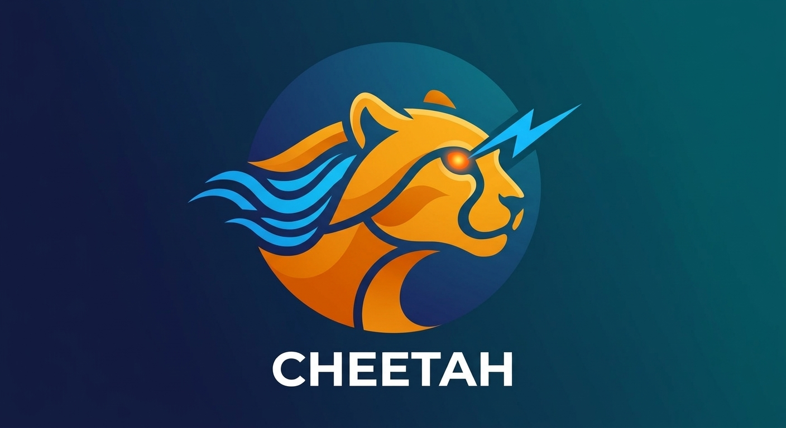

  

#  Cheetah - Processador de Relatórios Assíncrono (Asynchronous Report Processor)

> **API de Alta Performance para Processamento Assíncrono e Monitorização de Tarefas em Segundo Plano.**

O **Cheetah** é um microserviço desenvolvido em FastAPI focado na resolução de problemas de *blocking I/O* e *timeouts* em requisições de longa duração. Através do padrão arquitetural Asynchronous Request-Reply (Polling), a API aceita solicitações pesadas de processamento (ex: geração de relatórios complexos, conversão de ficheiros) e responde instantaneamente com confirmação de aceitação, delegando o trabalho para execução não-bloqueante em segundo plano.

---

##  Arquitetura e Padrões de Projeto 

[ Cliente / Frontend ]
|
|  1. POST /relatorios (Envio da solicitação)
v
+---------------+
|    FastAPI    |  ---> 2. Resposta INSTANTÂNEA (HTTP 202 Accepted + task_id)
+---------------+
|
|  3. Delegação em Background (BackgroundTasks)
v
+-------------------+
| Background Worker |  ---> 4. Atualiza progresso e salva resultado
+-------------------+
|
v
+-------------------+
|     fakeredis     |  <--- 5. GET /relatorios/{task_id} (Cliente consulta status)
| (State Store RAM) |
+-------------------+

### Principais Conceitos Aplicados:
* **Non-blocking I/O & HTTP 202 Accepted:** O cliente não fica bloqueado à espera do término do processamento.
* **State Management Atómico:** Gestão de estados da tarefa (`PENDING`, `PROCESSING`, `COMPLETED`) armazenados em memória temporária.
* **TTL (Time-To-Live):** Auto-expiração do resultado do relatório após 1 hora para otimização de memória.
* **Desacoplamento de Infraestrutura:** Uso de `fakeredis` para garantir compatibilidade e fidelidade de contrato da interface do Redis sem dependências externas de infraestrutura em ambiente de desenvolvimento local.

---

## Utiliza-se:

* **Linguagem:** Python 3.10+
* **Framework Web:** [FastAPI](https://fastapi.tiangolo.com/)
* **Servidor ASGI:** Uvicorn
* **Armazenamento de Estado:** [fakeredis](https://github.com/mher/fakeredis) (Redis em memória)
* **Validação de Dados:** Pydantic

##  Como Executar o Projeto Localmente :

### Pré-requisitos
* Python 3.10 ou superior instalado.

### Passo a Passo

Criar e ativar o ambiente virtual:

Windows (PowerShell):

PowerShell
python -m venv .venv
.\.venv\Scripts\activate
Linux/Mac:

Bash
python3 -m venv .venv
source .venv/bin/activate
Instalar as dependências:

Bash
pip install -r requirements.txt
Iniciar o servidor API:

Bash
uvicorn Cheetah:app --reload
Aceder à documentação interativa (Swagger UI):

Navegador: http://localhost:8000/docs